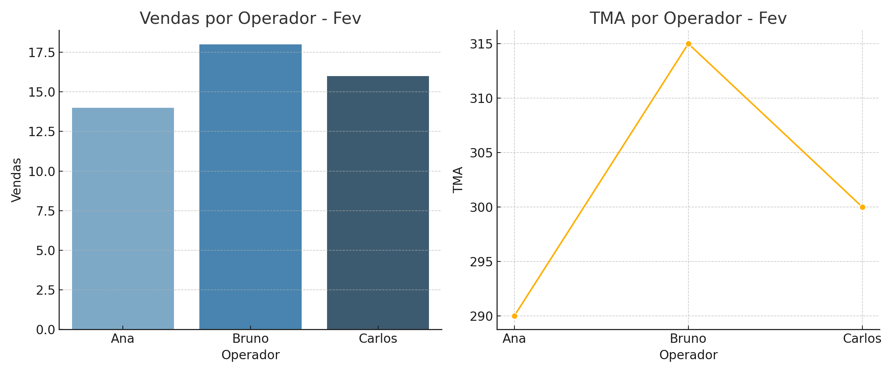

# 📞 Dashboard de Performance Operacional

Este projeto é um dashboard interativo desenvolvido com Python e Streamlit, simulando a análise de performance de operadores de atendimento. Ideal para quem atua com dados operacionais e quer demonstrar habilidades em Data Analytics.

## 🔍 Funcionalidades

- Filtro por mês
- Métricas principais (Vendas, TMA, Qualidade)
- Gráficos interativos com Plotly
- Interface limpa e responsiva

## 🛠️ Tecnologias usadas

- Python 3.10+
- Pandas
- Plotly
- Streamlit

## ▶️ Como rodar localmente

Clone o repositório e execute o Streamlit:

```bash
git clone https://github.com/seu-usuario/dashboard-performance-operacional.git
cd dashboard-performance-operacional
pip install -r requirements.txt
streamlit run app.py
```

## 📸 Screenshot



## 💼 Aplicações

Este projeto simula um cenário real de monitoramento de equipe em tempo real, ótimo para:

- Apresentações em entrevistas
- Portfólios de dados
- Aprendizado prático com dados operacionais

---

Desenvolvido por [Seu Nome](https://www.linkedin.com/in/caduserra).
